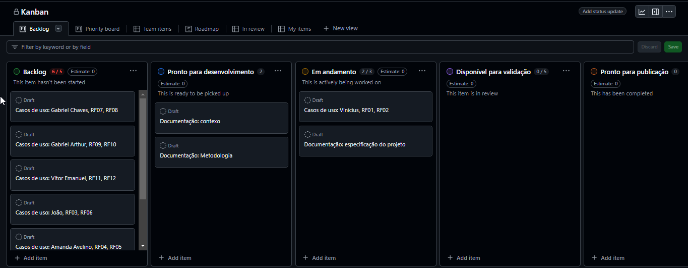
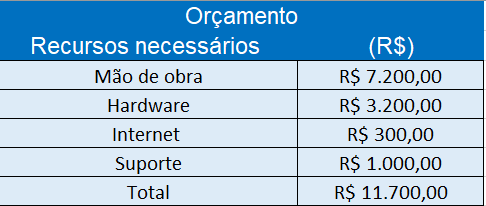

# Especificações do Projeto

## Personas

Persona 1: Flávia Cristina tem 43 anos, é formada em gestão de processos. Pensa em fazer doutorado em comunicações pela PUC Minas, é casada e possui uma filha. Está buscando uma empresa que realize eventos em casa, pois deseja fazer a festa da sua filha Júlia em sua residência. 

Persona 2: Claudionei Mello tem 53 anos, trabalha com recarga de cartuchos de empresoras, é casado e pai de 2 filhos. Pensa em realizar uma confraternização em sua empresa e deseja um serviço de eventos focado em pizzas que possa ir até sua empresa no dia da confraternização para fazer as pizzas e servi-lás.

Persona 3: Elivania Silveira tem 43 anos, formada em gastronomia e empreendedora há 6 anos no ramo. Há muito tempo sofre com o agendamento e o atendimento manual de seus clientes. Ela deseja uma maneira simples e eficaz para agendar e melhorar a qualidade da gestão e do serviço que ela e sua equipe presta. 

Persona 4: Maria Eduarda Silveira tem 19 anos, é estudante e filha de Elivania. Trabalha com a mãe há 5 anos em toda gestão da organização dos eventos, e deseja ajudar a mãe a agilizar e melhorar a qualidade do serviço prestado.

## Histórias de Usuários

Com base na análise das personas forma identificadas as seguintes histórias de usuários:

|EU COMO... `PERSONA`| QUERO/PRECISO ... `FUNCIONALIDADE` |PARA ... `MOTIVO/VALOR`                 |
|--------------------|------------------------------------|----------------------------------------|
|Dono de uma empresa | Preciso realizar uma festa para minha empresa     | Para fazer uma confraternização        |                                                          

|EU COMO... `PERSONA`| QUERO/PRECISO ... `FUNCIONALIDADE` |PARA ... `MOTIVO/VALOR`                 |
|--------------------|------------------------------------|----------------------------------------|
|Pai de familia      | Preciso realizar uma festa para  minha filha         | Para comemorar o aniversário dela      |
                                                                              

|EU COMO... `PERSONA`| QUERO/PRECISO ... `FUNCIONALIDADE` |PARA ... `MOTIVO/VALOR`                 |
|--------------------|------------------------------------|----------------------------------------|
|Dona da minha empresa        | Preciso gerir melhor toda minha empresa               | Para alavancar minhas vendas            
                                           

|EU COMO... `PERSONA`| QUERO/PRECISO ... `FUNCIONALIDADE` |PARA ... `MOTIVO/VALOR`                 |
|--------------------|------------------------------------|----------------------------------------|
|Filha da dona da empresa       | Preciso ter mais facilidade na gestão da empresa           | Para ajudar minha mãe nas vendas e gestão da empresa              
                                   
## Requisitos

### Requisitos Funcionais

|ID    | Descrição do Requisito  | Prioridade |
|------|-----------------------------------------|----|
|RF-001| O sistema deve ter uma tela de login  | ALTA | 
|RF-002| O sistema deve permitir cadastro de usuário| ALTA |
|RF-003| O sistema deve permitir cadastro de funcionário | ALTA |
|RF-004| O sistema deve permitir agendar um evento | ALTA |
|RF-005| O sistema deve permitir reagendar um evento | ALTA |
|RF-006| O sistema deve ter uma tela contando sobre a empresa | MÉDIA |
|RF-007| O sistema deve ter uma tela explicando como funciona | MÉDIA |
|RF-008| O sistema deve ter uma tela contendo valores | MÉDIA |
|RF-009| O sistema deve permitir agendamento de um evento | ALTA |
|RF-010| O sistema deve exibir lista de eventos agendados pro cliente | MÉDIA |
|RF-011| O sistema deve exibir lista de eventos agendados pro funcionário | MÉDIA |
|RF-012| O sistema deve permitir redirecionar o cliete para o whatsapp | MÉDIA |

### Requisitos não Funcionais

|ID     | Descrição do Requisito  |Prioridade |
|-------|-------------------------|----|
|RNF-001| O sistema não deve permitir que o usuário agende uma data anterior a data atual | ALTA | 
|RNF-002| O sistema só deve permitir agendamento com no mínimo uma semana de antecedência |  ALTA | 
|RNF-003| O sistema não deve permitir dois agendamentos no mesmo horário |  ALTA | 
|RNF-004| O sistema deve ser responsivo para diversos aparelhos móveis |  BAIXA | 
|RNF-005| O sistema deve ser intuitivo |  BAIXA |

## Restrições

O projeto está restrito pelos itens apresentados na tabela a seguir.

|ID| Restrição                                                    |
|--|--------------------------------------------------------------|
|01| O projeto deverá ser entregue até o final do semestre        |
|02| O projeto deverá seguir todas as datas de entrega            |
|03| Cada membro deve colaborar com todo desenvolvimento          |
|04| O cliente deve aprovar e avaliar todo processo               |
|05| Todo projeto deverá ser documento apenas no GitHub           |
|06| Deverá ser feita reuniões ou contatos semanais com o cliente |

## Diagrama de Casos de Uso

Casos de uso Amanda Avelino:

Casos de uso João Vitor:

06 drawio](https://github.com/user-attachments/assets/b329eb75-e985-4281-9be4-ce860c6234e0)

Casos de uso Gabriel Chaves:

Casos de uso Gabriel Arthur:

Casos de uso Vitor Emanuel:

Casos de uso Vinicius Mello:

# Gerenciamento de Projeto

Para o projeto será utilizado a metodologia ágil scrum. Essa metodologia separa as tarefas em sprints, onde cada sprint terá uma parte do projeto concluída no fim dela. Além disso,  será utilizado o quadro kanban do Github para organização de todas tarefas a serem feitas. Reuniões semanais entre os desenvolvedores serão realizadas a fim de alinhar todo processo de desenvolvimento; elas serão realizadas no aplicativo microsoft teams. Para acompanhamento por parte do cliente, um grupo no whatsapp foi criado para envio de todo processo de desenvolvimento, com objetivo de deixar o cliente sempre por dentro de toda atualização que será realizada, garantindo entregas contínuas e com qualidade sempre com aprovação das partes. Além disso, utilizaremos para controle de versão do código o github com branchs como main (código original), develop (código de teste de desenvolvimento) e uma branch específica para cada estória desenvolvida.   

## Gerenciamento de Tempo
Para o gerenciamento de tempo no nosso projeto, utilizaremos uma reunião planning que faremos a estimativa de todos as estórias planejadas e que entraram para aquela sprint. Para metrificar o tempo, teremos como base que 1 ponto será igual a 7 horas de desenvolvimento e, para não ocorrer transbordos, estabeleceremos que 1 ponto é igual a um modal simples no frontend da aplicação e no backend será igual a uma rota simples de busca de informação no banco(sem muitas regras de negócio).

## Gerenciamento de Equipe

O gerencimento da equipe será realizado através de um quadro kanban do Github que permitirá separar todas as tarefas a serem realizadas.

## Gestão de Orçamento

O processo de determinar o orçamento do projeto é uma tarefa que depende, além dos produtos (saídas) dos processos anteriores do gerenciamento de custos, também de produtos oferecidos por outros processos de gerenciamento, como o escopo e o tempo.

